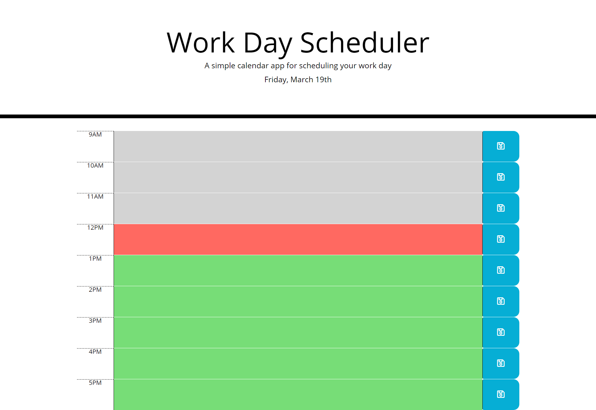

# 05-My-Day-Planner

-Fifth Assignment

## HTML, jQuery, Javascript + CSS

- I created a day planner using HTML, moment.js, jQQuery and Javascript styled with CSS.
- User will be able to input notes in each hour between 9AM-5PM dependent on their needs.
- The planner is color-coated by past, present, and future time. Gray = past, Pink = present, Green = future.
- Data will store when refreshed so the planner is kept up  for the day. 

### Link to deployed application
<a href="https://lyndseyfin.github.io/05-My-Day-Planner/"> Day Planner</a>

#### Screenshot

  
